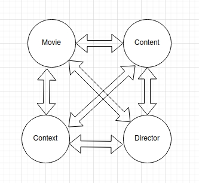

# Kinogeek

## Model

### Movie
- Je vous salue, Marie
- Taxi Driver

### Director
- Jean-Luce Godard
- Martin Scorsese

### Context
- French New Wave (1958 to late 1960s)
- New Hollywood (Mid-1960s to early 1980s)

### Content
- Jean-Luce Godard on The Dick Cavett Show